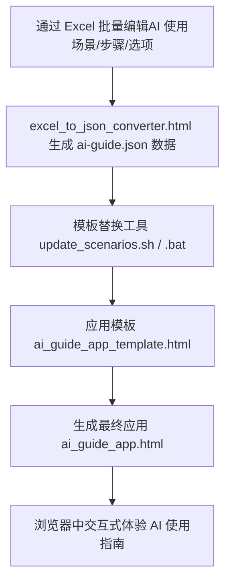

# AI使用指南项目

本项目旨在为中小学生提供交互式的人工智能（AI）合理使用指南，帮助学生在学习、写作、编程、实验等多种场景下科学、安全、高效地利用AI工具。

## 主要功能

- **场景化AI使用学习**：覆盖写作、数学、翻译、实验等典型学习场景。
- **交互式步骤与问题**：每个场景包含多个步骤和问题，支持选项判断与即时反馈。
- **数据可扩展**：支持通过Excel批量编辑和导入场景数据。
- **前端响应式UI**：适配桌面和移动端，体验友好。

## 目录结构

- `ai_guide_app_template.html`  —— 主应用HTML模板，数据占位符`$$json_data$$`
- `ai_guide_app.html`           —— 生成后的可用应用页面（含场景数据）
- `ai-guide.json`               —— 场景与步骤数据（JSON格式）
- `excel_to_json_converter.html`—— Excel转JSON工具，支持自定义场景/步骤/选项
- `update_scenarios.sh`         —— Linux/macOS下数据自动注入脚本
- `update_scenarios.bat`        —— Windows下数据自动注入脚本
- `LICENSE`                     —— MIT开源协议
- `基础数据.xlsx`                —— 原始数据编辑模板，便于批量管理和导入场景内容

## 使用方法

### 1. Excel 批量编辑与导入

- 使用 `excel_to_json_converter.html`，在浏览器中打开。
- 按模板填写场景、步骤、选项等内容，导出为 `ai-guide.json`。
- 支持"步骤"与"问题"类型区分，字段需严格对应。

### 2. 数据更新（JSON注入HTML）

- **Linux/macOS**：
  
  ```sh
  bash update_scenarios.sh
  # 或自定义参数
  bash update_scenarios.sh -t ai_guide_app_template.html -j ai-guide.json -o ai_guide_app.html
  ```

- **Windows**：
  
  ```bat
  update_scenarios.bat
  :: 或自定义参数
  update_scenarios.bat -t ai_guide_app_template.html -j ai-guide.json -o ai_guide_app.html
  ```

- 生成的 `ai_guide_app.html` 可直接用浏览器打开。

## 流程图



## Excel文件字段说明

`基础数据.xlsx` 用于批量编辑和管理AI使用场景数据。每一行代表一个步骤或问题，主要字段如下：

| Excel字段（中文）   | 说明                   | JSON字段（英文）      | 备注/示例                      |
|---------------------|------------------------|----------------------|-------------------------------|
| 场景                | 场景名称               | scene_title          | 如：写作辅助                   |
| 场景描述            | 场景简介/说明           | scene_desc           | 如：帮助学生高效写作           |
| 场景图标            | 场景图标（可选）        | scene_icon           | 如：✏️                        |
| 步骤编号            | 步骤唯一编号            | step_id              | 如：1                        |
| 步骤                | 步骤/问题内容           | step_content         | 如：明确写作主题               |
| 步骤还是问题        | 类型（步骤/问题）       | step_type            | 步骤 或 问题                   |
| 选项内容            | 选项                    | options              | 直接让AI根据题目生成一篇完整作文            |
| 类型                | AI使用方式类型          | type                 | 不用AI、合理用AI、错误使用AI   |
| 是否正确            | 选项是否为正确答案      | answer               | 是/否                          |
| 反馈说明            | 针对选项的反馈           | feedback             | 自己查找资料能提高信息筛选能力。      |
| 关联的AI伦理原则    | 涉及的AI伦理原则         | ai_ethics            | 公平、隐私、安全等              |

## 开源协议

本项目采用 [MIT License](LICENSE) 协议开源，允许自由使用、修改和分发，但需保留原作者信息和许可声明。

---

如有建议或合作意向，欢迎联系项目维护者。

