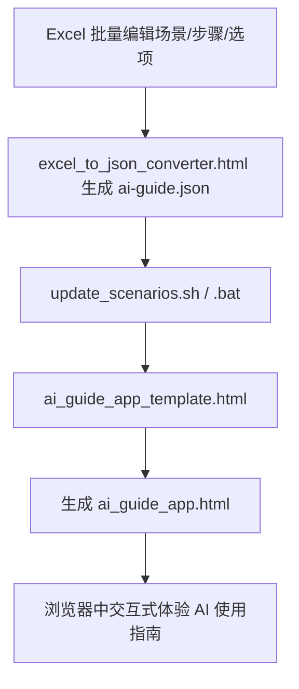

# AI使用指南项目

本项目旨在为中小学生提供交互式的人工智能（AI）合理使用指南，帮助学生在学习、写作、编程、实验等多种场景下科学、安全、高效地利用AI工具。

## 主要功能

- **场景化AI使用学习**：覆盖写作、数学、翻译、实验等典型学习场景。
- **交互式步骤与问题**：每个场景包含多个步骤和问题，支持选项判断与即时反馈。
- **数据可扩展**：支持通过Excel批量编辑和导入场景数据。
- **前端响应式UI**：适配桌面和移动端，体验友好。

## 目录结构

- `ai_guide_app_template.html`  —— 主应用HTML模板，数据占位符`$$json_data$$`
- `ai_guide_app.html`           —— 生成后的可用应用页面（含场景数据）
- `ai-guide.json`               —— 场景与步骤数据（JSON格式）
- `excel_to_json_converter.html`—— Excel转JSON工具，支持自定义场景/步骤/选项
- `update_scenarios.sh`         —— Linux/macOS下数据自动注入脚本
- `update_scenarios.bat`        —— Windows下数据自动注入脚本
- `LICENSE`                     —— MIT开源协议

## 使用方法

### 1. Excel 批量编辑与导入

- 使用 `excel_to_json_converter.html`，在浏览器中打开。
- 按模板填写场景、步骤、选项等内容，导出为 `ai-guide.json`。
- 支持"步骤"与"问题"类型区分，字段需严格对应。

### 2. 数据更新（JSON注入HTML）

- **Linux/macOS**：
  
  ```sh
  bash update_scenarios.sh
  # 或自定义参数
  bash update_scenarios.sh -t ai_guide_app_template.html -j ai-guide.json -o ai_guide_app.html
  ```

- **Windows**：
  
  ```bat
  update_scenarios.bat
  :: 或自定义参数
  update_scenarios.bat -t ai_guide_app_template.html -j ai-guide.json -o ai_guide_app.html
  ```

- 生成的 `ai_guide_app.html` 可直接用浏览器打开。

## 流程图



## 开源协议

本项目采用 [MIT License](LICENSE) 协议开源，允许自由使用、修改和分发，但需保留原作者信息和许可声明。

---

如有建议或合作意向，欢迎联系项目维护者。
